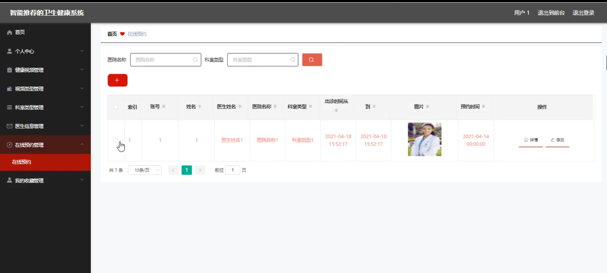

# 基于智能推荐的卫生健康系统

<h4 style='color:red'>联系不到我，就看我的主页 </h4> 
 
#### 介绍

本基于智能推荐的卫生健康系统是一款旨在为用户提供便捷、高效、个性化的医疗健康服务，并为管理员提供全面、精细管理功能的综合性平台。通过融合先进的技术和丰富的医疗资源，系统致力于改善医疗服务的可及性和质量，提升用户的健康体验。

#### 技术栈
软件架构说明

后端技术栈：Springboot+Mysql+Maven

前端技术栈：Vue+Html+Css+Javascript+ElementUI

开发工具：Idea+Vscode+Navicate

#### 系统功能介绍

（一）管理员角色  
个人中心  
管理员可以查看和修改个人基本信息，如姓名、联系方式等。  
查看个人的操作日志和系统通知。  
用户管理  
对系统注册用户进行全面管理，包括查看用户详细信息、审核用户注册申请。  
对违规或异常用户进行封禁、解冻等操作。  
健康视频管理  
上传、编辑和删除各类健康相关的视频资源。  
为视频添加标签、简介和分类，方便用户搜索和浏览。  
视频类型管理  
定义和创建不同的视频类型，如疾病预防、康复护理、健身锻炼等。  
对已有的视频类型进行修改和删除，以适应业务需求的变化。  
科室类型管理  
设立和维护医院的科室分类，如内科、外科、妇产科等。  
调整科室的属性和描述，确保科室信息的准确性和完整性。  
医生信息管理  
录入和更新医生的个人资料、专业特长、工作经历等信息。  
安排医生的排班和出诊时间。  
在线预约管理  
处理用户的在线预约请求，包括确认、取消和调整预约。    
查看预约统计数据，以优化医疗资源的分配。    
健康论坛    
监督论坛的交流内容，确保信息的合法性和健康性。    
对优质的帖子进行置顶、加精等操作，提升论坛的活跃度和质量。    
我的收藏管理    
管理自己收藏的重要信息、文档或链接。  
留言板管理  
查看用户的留言，及时回复和解决用户的问题与建议。  
删除不适当或无效的留言。  
系统管理  
进行系统的参数设置，如数据备份周期、权限分配规则等。  
监控系统的运行状态，包括服务器负载、数据库性能等。  
（二）用户角色  
健康论坛  
用户可以在论坛中发布与健康相关的话题，分享经验和心得。  
回复其他用户的帖子，参与讨论和交流。  
健康资讯  
浏览系统推送的最新健康新闻、研究成果和医疗动态。  
根据自己的兴趣和需求，筛选特定类型的健康资讯。  
留言反馈  
向平台提出意见和建议，反馈使用过程中的问题和不满。  
查看管理员对留言的回复，了解问题的处理进展。  
个人中心  
完善个人健康档案，包括基本身体状况、过往病史等。  
查看自己的预约记录、咨询历史和收藏内容。  
后台管理   
健康视频管理  
按照个人需求筛选和观看健康视频。  
对喜欢的视频进行收藏和点赞。  
视频类型管理  
选择感兴趣的视频类型，以便系统精准推荐相关视频。  
科室类型管理  
了解不同科室的诊疗范围和特色。  
根据自身症状初步判断应就诊的科室。  
医生信息管理  
查看医生的详细介绍和患者评价，选择心仪的医生。  
关注医生的出诊动态，方便预约就诊。  
在线预约管理  
在线提交预约申请，选择就诊时间和科室。  
查看预约的审批状态和提醒通知。  
我的收藏管理  
管理自己收藏的健康视频、医生信息等。  

#### 系统作用

对于用户  
提供便捷的医疗资源获取渠道，方便用户了解健康知识、预约医生和在线咨询。  
个性化的健康推荐，满足用户的特定需求，提升健康管理的效果。  
促进用户之间的交流和互助，形成良好的健康社区氛围。  

对于管理员  
实现高效的医疗资源和用户管理，提升服务质量和运营效率。  
通过数据分析和反馈，优化系统功能和服务内容。  
增强对医疗服务的监督和管理，保障医疗服务的规范性和安全性。  

#### 系统功能截图

代码结构

数据库表

登录

首页

健康论坛

留言反馈

个人中心

在线咨询

用户端后台管理

医生信息管理

在线预约管理

健康视频管理

管理端用户管理

健康资讯

#### 总结

本基于智能推荐的卫生健康系统通过丰富的功能模块和明确的角色分工，为用户和管理员搭建了一个互动、便捷、高效的医疗健康服务平台。在提高医疗服务可及性和质量的同时，也促进了健康知识的普及和传播，为人们的健康生活提供了有力的支持和保障。

#### 使用说明

创建数据库，执行数据库脚本 修改jdbc数据库连接参数 下载安装maven依赖jar 启动idea中的springboot项目

后台地址：http://localhost:8080/springboots3cpm/admin/dist/index.html

管理员  abo 密码 abo

前台地址：http://localhost:8080/springboots3cpm/front/index.html

